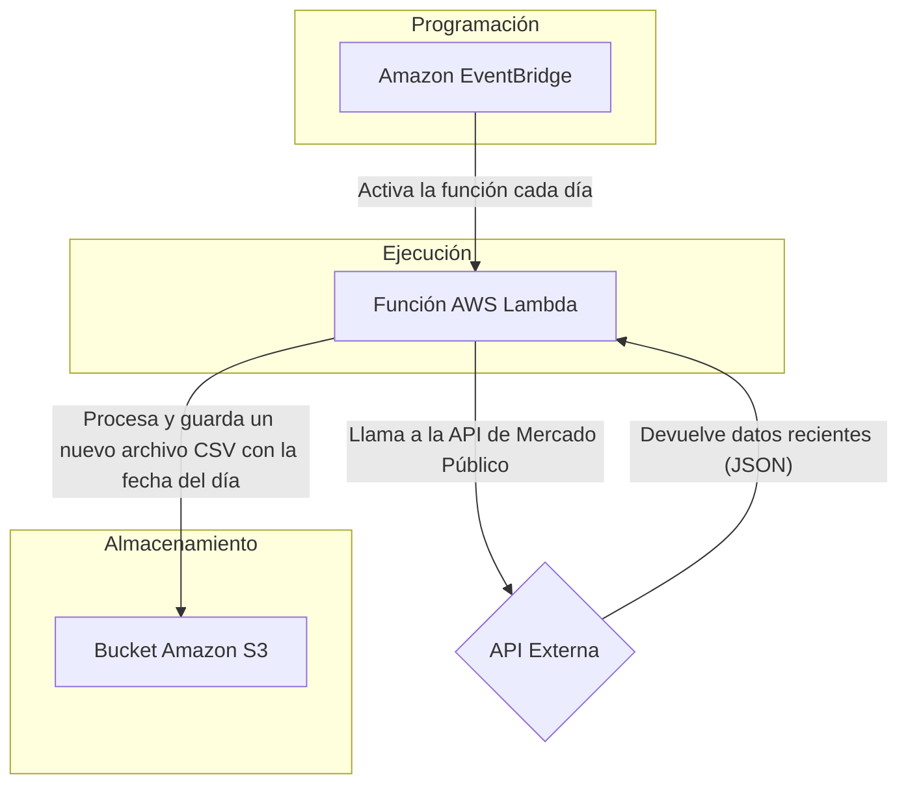

# Detección de anomalías en el Mercado Público de Chile

Este proyecto busca identificar patrones de compra inusuales y potenciales "red flags" dentro de los datos de Mercado Público de Chile. El objetivo es desarrollar un sistema de análisis que pueda alertar sobre transacciones con características atípicas, tales como licitaciones con un único oferente, adjudicaciones por montos cercanos al máximo presupuestado, o la concentración de contratos en proveedores nuevos.

El proyecto está dividido en dos fases principales:

* **Fase 1: Ingesta de datos** - Construcción de un pipeline automatizado para la recolección de datos.
* **Fase 2: Análisis de Datos** - Exploración y modelado de los datos para la detección de anomalías.

---
## Fase 1: Pipeline de Datos en AWS

Durante la exploración inicial, se descubrió una limitación crítica en la API de Mercado Público: **el endpoint no permite realizar consultas para fechas pasadas de manera fiable**, devolviendo errores al intentar acceder a datos históricos. La API está diseñada para entregar únicamente datos muy recientes (de las últimas 24-48 horas).

Para superar este obstáculo, en lugar de una extracción masiva única, se diseñó y construyó un **pipeline de datos diario y automatizado** en Amazon Web Services (AWS). Esta solución recolecta los datos cada día y los almacena de forma incremental, construyendo un dataset histórico a lo largo del tiempo.

### Arquitectura del Pipeline

El siguiente diagrama ilustra el flujo de trabajo automatizado:

### Tecnologías Utilizadas

 
   
   
   
   

    
   
   
   
   

---
## Cómo Reproducir la Pipeline

**Prerrequisitos:**

* Una cuenta de AWS con permisos para crear recursos en IAM, S3, Lambda y EventBridge.

* Un "Ticket" (API Key) válido de la API de Mercado Público.

**Crear un Bucket en S3:** Configura un bucket de S3 que servirá como el almacén para los archivos CSV diarios.

**Desplegar la Función Lambda:**

* Crea un Rol de IAM con los permisos necesarios (AWSLambdaBasicExecutionRole y AmazonS3FullAccess).

* Crea la primera función Lambda utilizando el script `lambda_function_licitaciones.py`.
* Crea la segunda función Lambda utilizando el script `lambda_function_ordenescompra.py`.

**Importante:**

Antes de desplegar, debes modificar las siguientes variables en el script con tus propios valores al principio del script:

`# Reemplaza con el nombre de tu bucket`

`NOMBRE_BUCKET = "NOMBRE_DE_TU_BUCKET_S3"`

`# Tu ticket de la API`

`MI_TICKET = "TICKET_DE_LA_API"`

**Automatizar con EventBridge:** 

Crea una regla de programación en Amazon EventBridge que active la función Lambda diariamente en el horario que prefieras.

**Puedes probar el funcionamiento correcto de la API y de tu API Key con el notebook de la carpeta `prueba local`**

---

## Fase 2: Análisis de Datos y Detección de Anomalías (en proceso)
(Esta sección se completará a medida que se obtengan datos para poder determinar el flujo del pipeline)

Una vez que el pipeline haya recolectado un volumen de datos suficiente, se procederá a:

Carga y Limpieza: Leer los archivos CSV diarios desde S3, unificarlos en un solo DataFrame y realizar la limpieza y preprocesamiento de los datos.

Análisis Exploratorio (EDA): Investigar las distribuciones, identificar proveedores y organismos con mayor actividad, y analizar la frecuencia de los tipos de compra.

Detección de anomalías: Aplicar reglas de negocio y modelos estadísticos para identificar red flags.

---

## Estructura del Repositorio

* `prueba local` Carpeta que contiene un notebook para hacer una prueba local de la API y de la API Key obtenida.
* `lambda_function_licitaciones.py`
* `lambda_function_ordenescompra.py`
* `requeriments.txt`

---
## Autor

**Ricardo Urdaneta**

* [GitHub](https://github.com/Ricardouchub)
* [LinkedIn](https://www.linkedin.com/in/ricardourdanetacastro)
